

  

<h1 align="center">Mini Games Emporium</h1>

  A Dalamud plugin for Final Fantasy XIV, the official mini game hub for OOF Games venues.

---

## Overview

**Mini Games Emporium** is the all-in-one hosting tool powering every mini game run at OOF Games. It handles everything a host needs: player queues, session tracking, trade verification, automated chat announcements, and a full transaction ledger, so the host can stay focused on the crowd, not the spreadsheet.

The plugin lives inside FFXIV via the [Dalamud](https://github.com/goatcorp/Dalamud) framework and is accessed with `/mge` or `/minigamesemporium`.

### What's Inside

| Game | Status |
|---|---|
| **BAR 777** | ✅ Live |
| **Coin Collector** | ✅ Live |
| **Deathroll Tournament** | ✅ Live |
| **Higher/Lower** | ✅ Live |
| **Raffle** | ✅ Live |
| **Voting Madness** | ✅ Live |
| 8 Ball Pool | 🔜 Coming Soon |
| Beer Pong | 🔜 Coming Soon |
| Darts | 🔜 Coming Soon |
| Deal or No Deal | 🔜 Coming Soon |
| Minefield Gambit | 🔜 Coming Soon |
| Raid Boss | 🔜 Coming Soon |
| Russian Roulette | 🔜 Coming Soon |

Each game gets its own tab inside the plugin's **Mini Games** section, styled in its own neon accent colour. The main window also holds a **Transaction History** ledger and a top-level **Settings** tab.

---

## BAR 777

BAR 777 is OOF Games' flagship game. Players pay an entry fee, then use FFXIV's built-in `/random` command to roll for the winning number. Hit it within the allotted rolls and you take home the pot.

### How It Works

1. The host opens the BAR 777 door, sets the entry cost, roll count, and winning number, then clicks **Start Session** (green button).
2. A player is pulled from the queue (or walks in) and the host targets them to lock them in.
3. The host clicks **Trade** to open a trade, and the plugin waits for the player's Gil to come through.
4. Once payment is verified, the host sends the start message and the player begins rolling `/random`.
5. The plugin watches chat in real time. Every roll is logged and compared against the winning number.
6. If the player hits the number, a win is detected automatically and a shout goes out. If they exhaust their rolls, an unlucky message fires and the session closes.
7. **End Session & Process Next** advances the queue and the next player is pulled in automatically.

### Entry Modes

#### Walk-in Mode

Walk-in is the default. There is no queue; players approach the host directly and are added to the session on the spot. The game tab goes full-width and shows a permanent **End Session** button. Ideal for low-traffic events or drop-in style nights.

#### Queue Mode

Queue mode activates an automatic waitlist. Players type a configured keyword (e.g. `!join`) in say, shout, yell, or tell and are added to the queue instantly. The plugin sends them a tell confirming their position.

The right-hand column of the Game tab shows the live queue at all times:

- **Current** - the active player with controls (To Back Q / Remove / End Session & Process Next)
- **Waiting list** - everyone else in order, with a manual add field at the bottom
- The queue persists across plugin restarts, so a crash mid-event doesn't wipe the list

When the active session ends normally, **End Session & Process Next** removes that player from the queue head and starts the next one automatically. **Stop Session** clears only the active session and leaves the waitlist untouched.

### Statistics Panel

The Statistics panel at the bottom of the Game tab shows the live pot and session figures:

| Row | Description |
|---|---|
| **Total Pot** | Boosted Pot + the configured share of trade revenue; the **Announce Pot** button shouts it on demand |
| **Boosted Pot** | Extra Gil added by the venue on top of trade revenue |
| **Taken in Trades** | Total Gil collected from players this session |
| **Kept from Trades** | Portion of trade revenue held back for the venue (shown only when Trades to Pot is below 100%) |
| **Players Played** | Number of players who have played this session |
| **In Queue** | Players waiting to play (queue mode only) |

**Trades to Pot (%)**, set on the door, controls how much of the trade revenue feeds the pot: `Total Pot = Boosted Pot + (Taken in Trades × Trades to Pot %)`. Whatever is not fed to the pot shows as Kept from Trades. The **Adjust Pot (Gil)** row lets the host add or remove Gil from the pot directly at any time.

### Automated Chat

BAR 777 includes a full set of customisable message templates, each editable in the Chat tab with toggleable auto-send where noted:

| Template | Trigger |
|---|---|
| Rules | Manually via **Send Rules** on the session control bar (each line is sent as its own message) |
| Advertise | Manually via **Advertise** on the session control bar |
| Request Gil | Manually from the Game tab |
| Request Gil (Buyer) | Manually, when someone else is paying for the player |
| Start Rolls | When payment is verified (auto-send toggle) |
| Halfway | At the halfway point of the player's rolls (auto-send toggle) |
| Unlucky | When all rolls are exhausted with no win (auto-send toggle) |
| Win Shout | On win detection, includes the total pot (auto-send toggle) |
| Announce Pot | Posts the current pot on demand |
| Announce Keyword | Shouts the join keyword to invite players (queue mode) |
| Join Queue | Tells a player their position when they join (auto-send toggle) |
| Reminder to Play | Reminds upcoming players once the queue reaches a set size (auto-send toggle) |
| Next Player Up | Announces the next player in the queue |

A **channel selector** (Say / Party / Alliance) sits above the templates and rewrites the leading channel prefix of every message in one click, switching the whole set between `/say`, `/party`, and `/alliance` at once. Dedicated `/tell`, `/yell`, and `/shout` messages keep their own channel.

All outbound messages are queued with a one-second gap between each to stay within FFXIV's chat rate limits.

### Screenshots

> **BAR 777 Door (Pre-Session)**
>
> 

---
> **Game Tab: Queue Mode**
>
> 

---

> **Game Tab: Walk-in Mode**
>
> 

---

> **Chat Settings Tab**
>
> 

---

## Coin Collector

Coin Collector is a party-based survival game built on the deathroll mechanic. The player rolls `/dice` for a starting number, then keeps rolling using their last result as the new maximum. Every roll that is not a 1 earns a coin; rolling a 1 ends their turn. Players take turns in the same session and the biggest hoard takes the pot.

### How It Works

1. The host opens the Coin Collector door, sets the entry cost, boosted pot, starting roll max, and win options, then clicks **Start Session**.
2. The host invites the player to their party so everyone can see the rolls, then selects them from the party list.
3. The host collects the entry cost via trade; once payment is verified the turn begins.
4. The player rolls `/dice` for their starting number. That opening roll earns a coin too, and sets the ceiling for the next one.
5. The player rolls `/dice <their last result>`. Every result other than a 1 earns a coin and becomes the new maximum. **Ask to Roll** tells them which command to type next.
6. Rolling a 1 ends the turn and records their coin count on the leaderboard. The next player is pulled in and paid up the same way.
7. Once everyone has played, the host clicks **Finish Game** to lock in the winner(s) and pay out the pot.

### Game Options

Set on the door before the session starts:

| Option | Description |
|---|---|
| **Entry Cost** | Gil each player pays to take a turn |
| **Boosted Pot** | Extra Gil added by the venue on top of trade revenue |
| **Starting Roll Max** | Ceiling for the opening roll (default 999). At 999 the player opens with a plain `/dice`; set lower, they must roll `/dice <that number>` |
| **Auto Win Count** | When on, a player who reaches the target coin count wins instantly |
| **Allow Multiple Winners** | When on, everyone tied on the top coin count shares the pot; when off, the first player to reach it wins outright |
| **Trades to Pot (%)** | Portion of trade revenue that feeds the pot; the remainder is held back for the venue |

### Roll Detection

Rolls are read from party and alliance chat and validated before they count. Only the player taking their turn is scored, and each roll's maximum must match their previous result - rolling `/dice 50` when the hint says `/dice 137` is ignored rather than scored. A stray `/dice` from anyone else in the party cannot corrupt a turn.

### Statistics Panel

The Statistics panel at the bottom of the Game tab shows the live pot and session figures:

| Row | Description |
|---|---|
| **Total Pot** | Boosted Pot + the configured share of trade revenue, split between all winners; the **Announce Pot** button shouts it on demand |
| **Boosted Pot** | Extra Gil added by the venue on top of trade revenue |
| **Taken in Trades** | Total Gil collected from players this session |
| **Kept from Trades** | Portion of trade revenue held back for the venue (shown only when Trades to Pot is below 100%) |
| **Players Played** | Number of players who have taken a turn this session |
| **Most Coins** | The highest coin count reached so far this session |
| **Currently Winning** | The player (or players) on top of the leaderboard |

**Trades to Pot (%)**, set on the door, controls how much of the trade revenue feeds the pot; whatever is not fed to the pot shows as Kept from Trades.

### Automated Chat

Coin Collector includes fully customisable message templates with toggleable auto-send:

| Template | Trigger |
|---|---|
| Rules | Manually via **Send Rules** on the session control bar (each line is sent as its own message) |
| Advertise | Manually via **Advertise** on the session control bar |
| Request Gil | Manually from the Game tab |
| Request Gil (Buyer) | Manually, when someone else is paying for the player |
| Ask to Roll | Before each roll, with the next dice number and the player's coin count once they have one (auto-send toggle) |
| Announce Score | When a turn ends and the player is not in the lead (auto-send toggle) |
| Announce Lead | When a turn ends and the player is in the lead (auto-send toggle) |
| Win Shout | On the winner screen, includes the winner's share of the pot |
| Announce Pot | Posts the current pot on demand |

All outbound messages are queued with a one-second gap between each to stay within FFXIV's chat rate limits.

### Winner Payout

When the session finishes, the winner screen shows each winner's share of the pot. The host can **Announce Winner**, **Trade Winner** to pay them by hand, or use **Auto Payout** to send their share automatically. A progress bar tracks how much of each winner's share has been paid out.

### Screenshots

> **Session Tab (Pre-Session)**
>
> 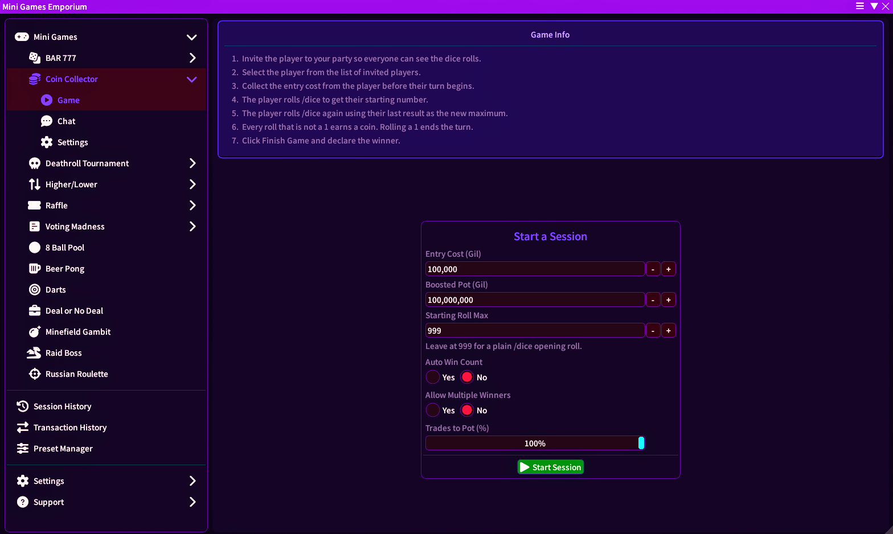

---

> **Game Tab: Select Player**
>
> 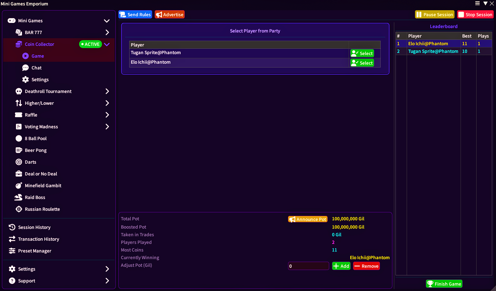

---

> **Game Tab: Payment**
>
> 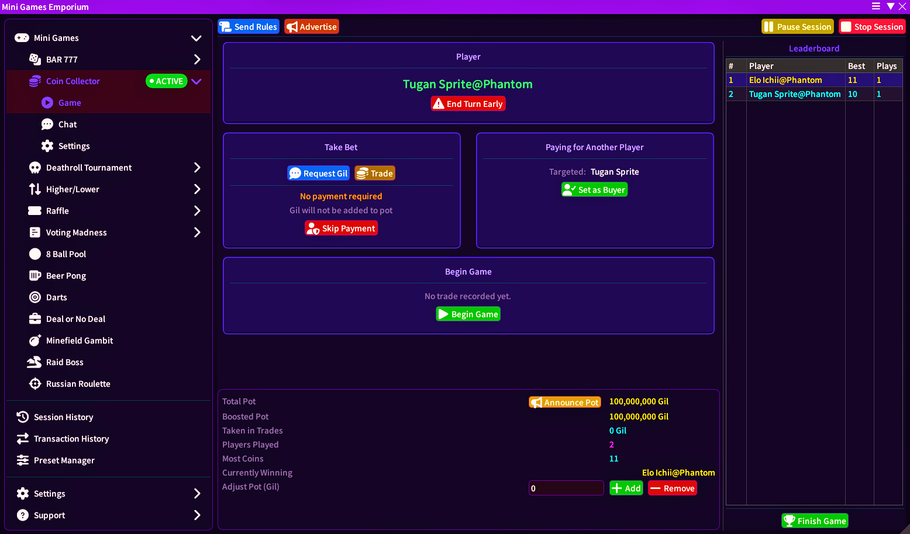

---

> **Game Tab: In Play**
>
> 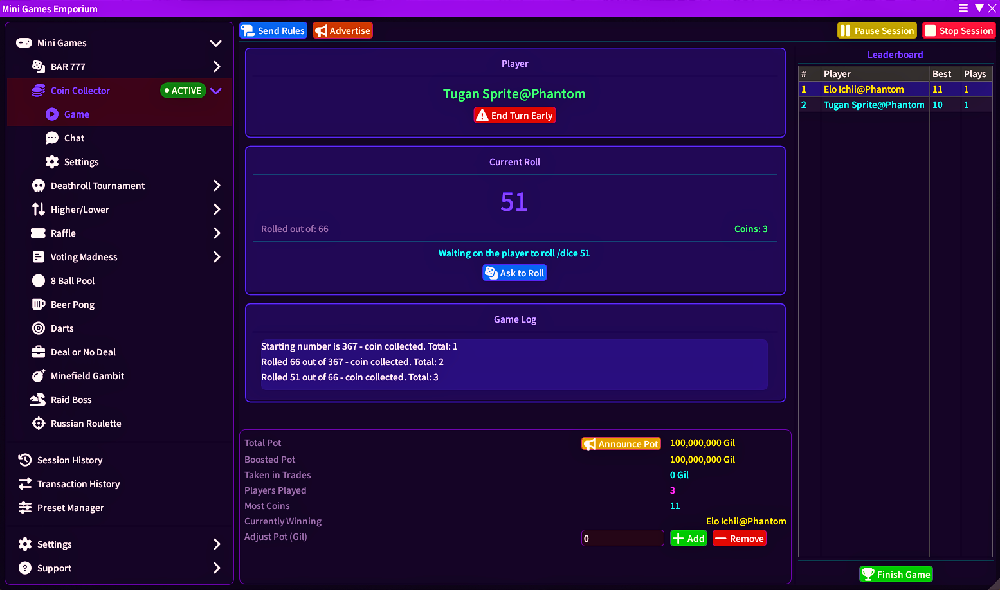

---

> **Game Tab: Finish Game**
>
> 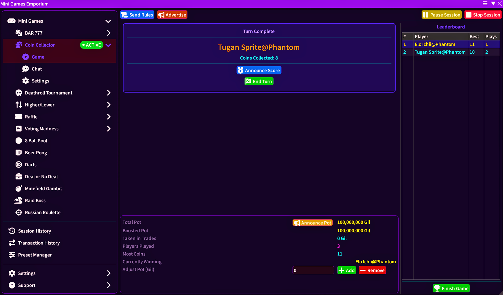

---

> **Session Complete: Winner Payout**
>
> 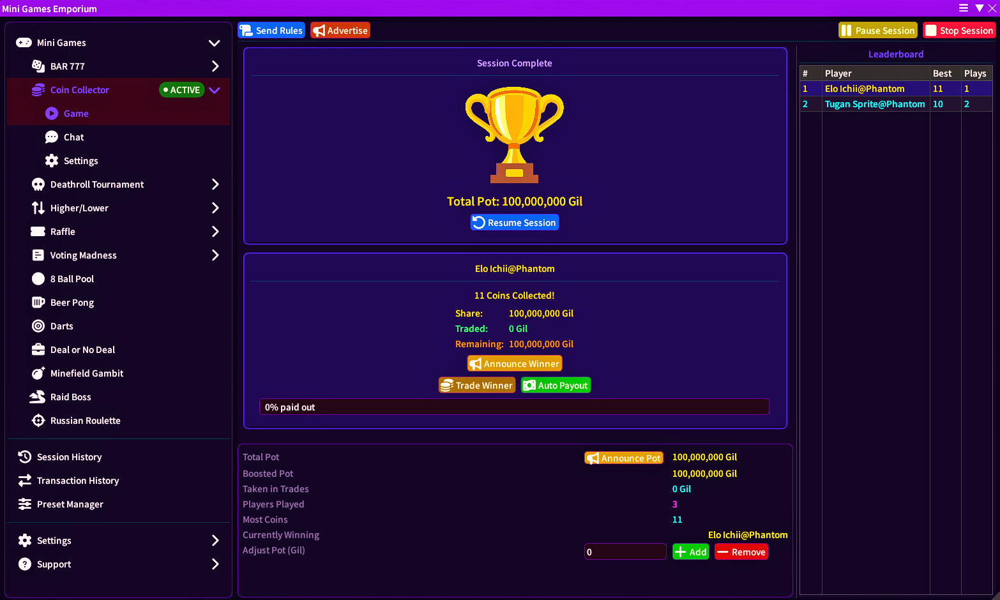

---

## Deathroll Tournament

Deathroll Tournament is a bracket-based elimination game. Each registered player pays an entry fee and competes in head-to-head deathroll matches. In deathroll, each player rolls within the range of the previous roll, starting from an agreed ceiling. The first player to roll a 1 loses the match. The plugin manages registration, seeding, the bracket, and all automated chat, so the host only needs to click to advance.

### How It Works

1. The host opens the Deathroll Tournament door, sets the entry cost, boosted pot, and best-of series lengths for each round, then clicks **Start Session**.
2. Players register by typing the join keyword in chat; the host marks each as **Paid** in the Registration tab once their Gil comes through.
3. When all paid players are confirmed, the host clicks **Start Tournament** to seed the bracket automatically (power-of-two seeding; bye slots are auto-resolved).
4. The plugin announces the first matchup and uses `/random 10` to determine which player rolls first.
5. Players deathroll in order. The plugin watches for the losing roll (a result of 1) and auto-advances the match.
6. The winner advances in the bracket; the next match is announced automatically.
7. The tournament ends when one player remains. A winner announcement fires and the Discord embed updates to show the champion.

### Registration

The Registration tab shows every player who has typed the join keyword. The host ticks each player as **Paid** once their trade clears. Only paid players are seeded into the bracket.

- **Entry Cost** - Gil each paid player owes the host.
- **Boosted Pot** - Extra Gil added by the venue on top of entry fees.
- **Registered** - All players who joined, including those not yet marked as paid.
- **Paid** - Players confirmed for the bracket.

### The Bracket

Once started, the Bracket tab shows the full single-elimination bracket in real time. Matches highlight the current pairing; completed matches show the winner in green. Bye slots are resolved instantly with no announcement.

The bracket is seeded in a standard power-of-two layout. If the paid player count is not a power of two, the plugin fills the smallest number of first-round byes required to reach the next power of two.

### Best-of Series

Each round can be configured with its own best-of count before the tournament starts (for example, Best of 1 in early rounds, Best of 3 in the semi-finals, Best of 5 in the final). The plugin tracks wins per match and only advances a player when they reach the winning threshold.

### Statistics Panel

The Statistics panel at the bottom of the Game tab shows the live pot and tournament figures:

| Row | Description |
|---|---|
| **Total Pot** | Entry fees from all paid players + Boosted Pot; the **Announce Pot** button shouts it on demand |
| **Entry Cost** | Gil each paid player owes |
| **Boosted Pot** | Extra Gil added by the venue on top of entry fees |
| **Players** | Number of paid players in the tournament |
| **Round** | The current round, e.g. "Round 2 of 4" |

The **Adjust Pot (Gil)** row lets the host add or remove Gil from the pot directly at any time.

### Automated Chat

Deathroll Tournament includes a full set of customisable message templates, each editable in the Chat tab with toggleable auto-send where noted:

| Template | Trigger |
|---|---|
| Rules | Manually via **Send Rules** on the session control bar (each line is sent as its own message) |
| Advertise | Manually via **Advertise** on the session control bar |
| Request Gil | Manually per player from the Registration table |
| Request Gil (Buyer) | Manually, when someone else is paying a player's entry |
| Announce Bracket | When the bracket is generated; posts the matchups |
| Announce Matchup | At the start of each match (auto-send toggle) |
| First Player | After `/random 10` determines who rolls first (auto-send toggle) |
| Re-roll Random 10 | When both players tie their `/random 10` and must roll again (auto-send toggle) |
| Announce Round Win | When a player wins a single game but the series continues (auto-send toggle) |
| Announce Match Win | When a player wins the series and their opponent is eliminated (auto-send toggle) |
| Announce Winner | When the final match resolves and the tournament winner is decided (auto-send toggle) |
| Announce Pot | Posts the current pot on demand |

All outbound messages are queued with a one-second gap between each to stay within FFXIV's chat rate limits.

### Discord Webhook

Deathroll Tournament can post and live-update a single Discord embed via a channel webhook throughout the event.

To set it up, go to the **Discord** tab within the Deathroll Tournament panel:

1. In Discord, open channel settings for your tournament announcement channel, go to **Integrations > Webhooks**, and copy the webhook URL.
2. Paste the URL into the Webhook URL field and tick **Enable**.
3. The plugin will post the embed immediately and patch it automatically as the tournament progresses.

| Phase | Embed content |
|---|---|
| No session active | "No Tournament Active" banner with the Deathroll Tournament logo |
| Registration open | Player card showing all paid players, entry cost, and current pot |
| Tournament running | Live bracket image with current match and score highlighted |
| Tournament complete | Final bracket image with the winner and pot total |

If the Discord message is deleted, toggle **Enable** off then on to create a fresh embed. The same toggle retries a failed delivery.

### Screenshots

> **Session Tab (Pre-Session)**
>
> 

---

> **Lobby (Registration)**
>
> 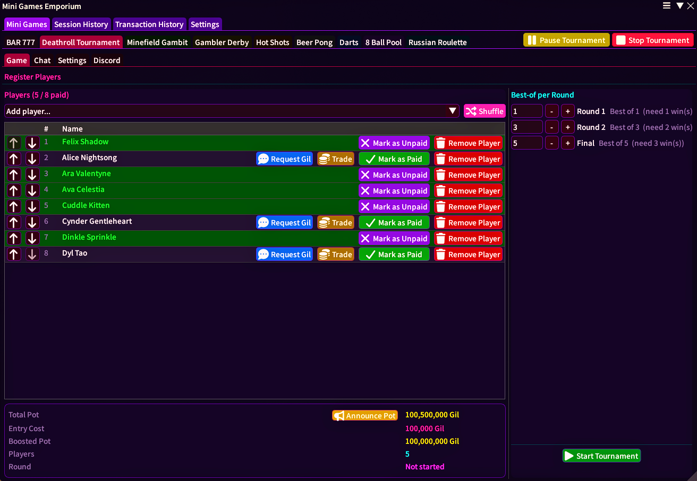

---

> **Bracket**
>
> 

---

> **Example: Live Bracket Embed (Discord)**
>
> 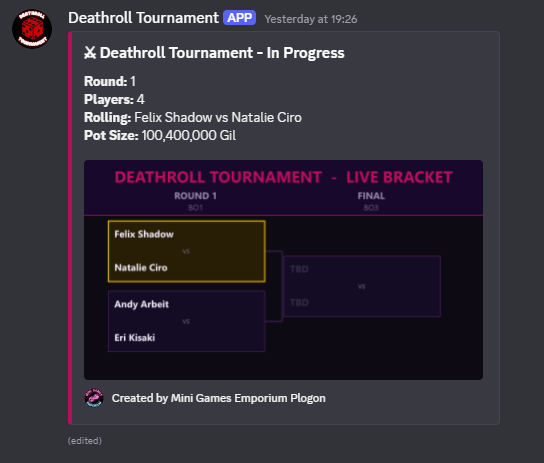

---

> **Example: Live Lobby Embed (Discord)**
>
> 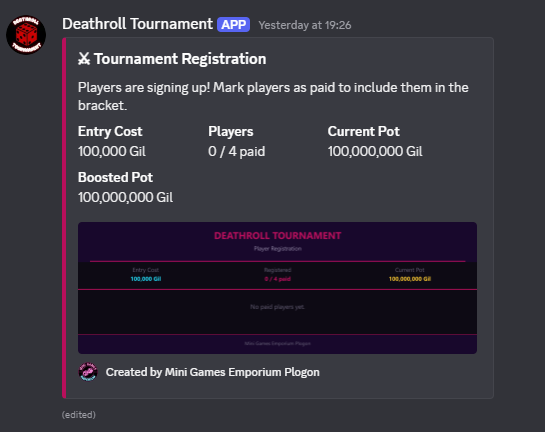

---

> **Web Spectator Tab**
>
> 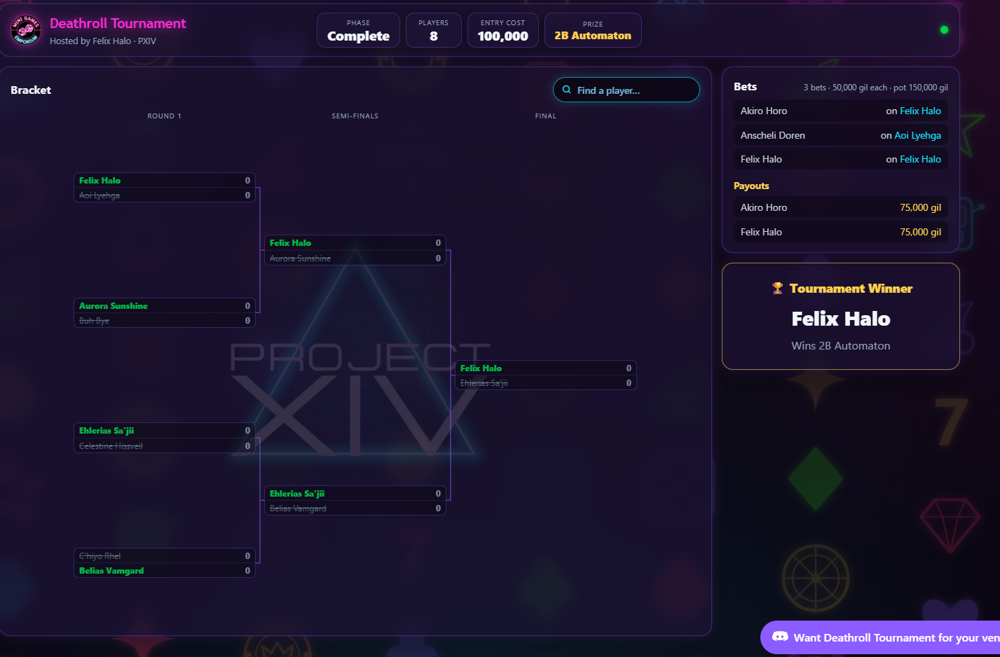

---

## Higher/Lower

Higher/Lower is a party-based streak game. The host rolls a dice with `/dice`, and the player calls whether the next roll will be higher or lower. Every correct call extends their round streak; one wrong call ends their turn. Multiple players each take a turn in the same session, and whoever builds the longest streak takes the pot. The plugin reads the rolls and the player's guess straight from chat, tracks a live leaderboard, and handles the winner payout.

### How It Works

1. The host opens the Higher/Lower door, sets the entry cost, boosted pot, dice size, and win options, then clicks **Start Session**.
2. The host invites the player to their party so they can see the dice rolls, then selects them from the party list.
3. The host collects the entry cost via trade; once payment is verified the turn begins.
4. The host rolls `/dice X` (the configured dice size) to set the opening number.
5. The player calls **Higher** or **Lower** for the next roll, either by typing it in party chat or by the host clicking the button.
6. The host rolls again. A correct call increases the round count and play continues; a wrong call ends the turn. Rolling the same number is a no-op, so the host simply rolls once more.
7. When a turn ends, the player's best streak is recorded on the leaderboard. The next player is pulled in and paid up the same way.
8. Once everyone has played, the host clicks **Finish Game** to lock in the winner(s) and pay out the pot.

### Game Options

Set on the door before the session starts:

| Option | Description |
|---|---|
| **Entry Cost** | Gil each player pays to take a turn |
| **Boosted Pot** | Extra Gil added by the venue on top of trade revenue |
| **Host roll /dice X** | Dice size the host rolls (default 10) |
| **Auto Win Count** | When on, a player who reaches the target round count wins instantly |
| **Allow Multiple Winners** | When on, everyone tied on the top streak shares the pot; when off, the first player to reach the top streak wins outright |
| **Trades to Pot (%)** | Portion of trade revenue that feeds the pot; the remainder is held back for the venue |

### Guess Detection

The player's call is picked up automatically from party or alliance chat: any message containing `h`, `high`, or `higher` registers a Higher guess, and `l`, `low`, or `lower` registers Lower. The host can also click the **Higher** / **Lower** buttons directly, or use **Ask Guess** to prompt the player for their call.

### Statistics Panel

The Statistics panel at the bottom of the Game tab shows the live pot and session figures:

| Row | Description |
|---|---|
| **Total Pot** | Boosted Pot + the configured share of trade revenue, split between all winners; the **Announce Pot** button shouts it on demand |
| **Boosted Pot** | Extra Gil added by the venue on top of trade revenue |
| **Taken in Trades** | Total Gil collected from players this session |
| **Kept from Trades** | Portion of trade revenue held back for the venue (shown only when Trades to Pot is below 100%) |
| **Players Played** | Number of players who have taken a turn this session |
| **Highest Rounds** | The best streak reached so far this session |
| **Currently Winning** | The player (or players) on top of the leaderboard |

**Trades to Pot (%)**, set on the door, controls how much of the trade revenue feeds the pot; whatever is not fed to the pot shows as Kept from Trades.

### Automated Chat

Higher/Lower includes fully customisable message templates with toggleable auto-send:

| Template | Trigger |
|---|---|
| Rules | Manually via **Send Rules** on the session control bar (each line is sent as its own message) |
| Advertise | Manually via **Advertise** on the session control bar |
| Request Gil | Manually from the Game tab |
| Request Gil (Buyer) | Manually, when someone else is paying for the player |
| Let's Play | When payment is verified (auto-send toggle) |
| Ask Guess | After each roll while awaiting the player's guess (auto-send toggle) |
| Announce Score | When a turn ends and the player is not in the lead (auto-send toggle) |
| Announce Lead | When a turn ends and the player is in the lead (auto-send toggle) |
| Win Shout | On the winner screen, includes the winner's share of the pot |
| Announce Pot | Posts the current pot on demand |

All outbound messages are queued with a one-second gap between each to stay within FFXIV's chat rate limits.

### Winner Payout

When the session finishes, the winner screen shows each winner's share of the pot. The host can **Announce Winner**, **Trade Winner** to pay them by hand, or use **Auto Payout** to send their share automatically. A progress bar tracks how much of each winner's share has been paid out.

### Screenshots

> **Session Tab (Pre-Session)**
>
> 

---

> **Game Tab: Select Player**
>
> 

---

> **Game Tab: In Play**
>
> 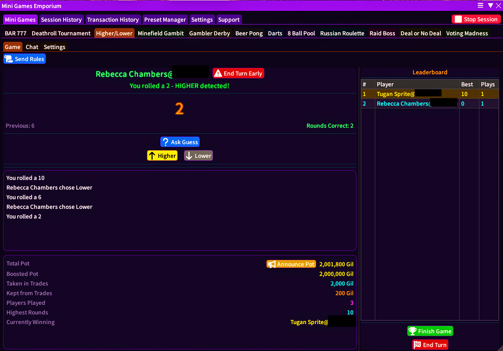

---

> **Game Tab: Turn Complete**
>
> 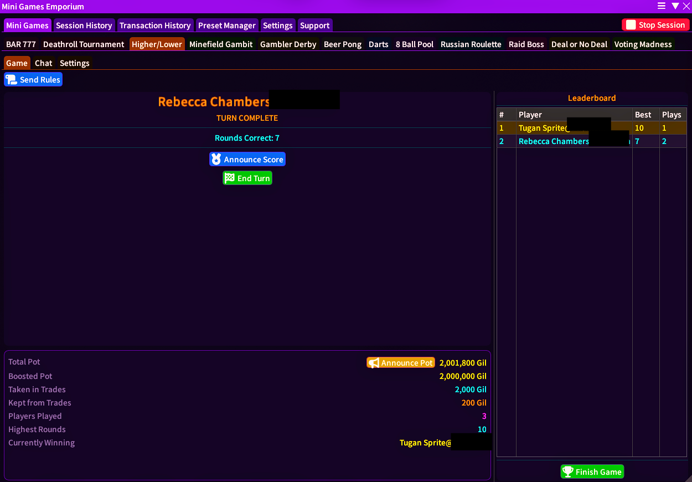

---

> **Session Complete: Winner Payout**
>
> 

---

## Raffle

Raffle is a numbered-ticket draw. Players buy tickets at a fixed Gil cost and each ticket claims the next number in an ever-growing pool. When the host is ready, they roll `/random` up to the highest number sold, and whoever holds the rolled number takes the whole pot.

### How It Works

1. The host opens the Raffle door, sets the ticket cost, boosted pot, max tickets per player, and optionally a closing time, then clicks **Start Session**.
2. Players are added to the list manually, via the nearby-player search, or automatically by typing a join keyword in chat (if enabled) - joining alone does not grant tickets.
3. The host collects Gil by trade. A completed trade auto-calculates tickets as `floor(Gil received / ticket cost)` and grants the next free numbers automatically. Any leftover Gil under the cost of one ticket is held as credit and combines with the player's next trade.
4. Tickets can also be granted or removed manually from each player's row, which is how free raffles (ticket cost set to 0) hand out numbers.
5. When ready to draw, the host clicks **Draw Winner** to arm the draw, then rolls `/random <highest number sold>` in game. The plugin captures the host's own roll and resolves the winner from the ticket ranges.
6. If the rolled number falls in a gap (numbers freed by a removed player), no winner is found and the host clears the draw to roll again. The host can also set the winning number manually.
7. Once a winner is resolved, the host announces the win, trades the pot to the winner (or uses Auto Payout), then clears the draw to start a fresh raffle.

### Ticket Numbering

Tickets are issued as numbered blocks in purchase order. Each purchase claims the next free numbers: first any gaps left behind by removed players, then new numbers extending the pool upward. A player who buys tickets across multiple trades can end up owning several separate number ranges. Removing a player frees their numbers as a permanent gap - existing players keep their numbers and are never renumbered. The ticket pool is capped at 999.

### Closing Time

The host can optionally set a closing time in Server Time on the door. This purely drives the countdown display shown on the Game tab and the closing-time chat announcement - it does not lock ticket sales or trigger an automatic draw. The raffle stays open until the host manually arms and rolls the draw.

### Statistics Panel

The Statistics panel at the bottom of the Game tab shows the live pot and ticket figures:

| Row | Description |
|---|---|
| **Total Pot** | Boosted Pot + the configured share of ticket revenue; the **Announce Pot** button shouts it on demand |
| **Boosted Pot** | Extra Gil added by the venue on top of ticket revenue |
| **Kept from Trades** | Portion of ticket revenue held back for the venue (shown only when Trades to Pot is below 100%) |
| **Ticket Cost** | Gil per ticket, or "Free" when set to 0 |
| **Players** | Number of players who currently hold at least one ticket |
| **Tickets Sold** | Total tickets sold this session |

**Trades to Pot (%)**, set on the door, controls how much of the ticket revenue feeds the pot; whatever is not fed to the pot shows as Kept from Trades. The **Adjust Pot (Gil)** row lets the host add or remove Gil from the pot directly at any time.

### Automated Chat

Raffle includes a full set of customisable message templates, each editable in the Chat tab with toggleable auto-send where noted:

| Template | Trigger |
|---|---|
| Rules | Manually via **Send Rules** on the session control bar (each line is sent as its own message) |
| Advertise | Manually via **Advertise** on the session control bar |
| Request Gil | Manually from the Game tab |
| Request Gil (Buyer) | Manually, when someone else is paying for a player's tickets |
| Tickets Sold | Manually, shouts the current number of tickets sold |
| Closing Time | Manually, shouts the closing time and time remaining |
| Join Reminder | Manually, invites players to join with the keyword (keyword join mode only) |
| Ticket Numbers | Tells a player their ticket number(s), manually or automatically when tickets are granted by trade (auto-send toggle) |
| Announce Winner | On the draw result, includes the winning number and the pot (auto-send toggle) |
| Announce Pot | Posts the current pot on demand |

All outbound messages are queued with a one-second gap between each to stay within FFXIV's chat rate limits.

### Winner Payout

Once a winner is drawn, the winner screen shows the pot, the amount traded to the winner so far, and the remaining balance. The host can **Announce Winner**, **Trade Winner** to pay them by hand, or use **Auto Payout** to send their share automatically. A progress bar tracks how much of the pot has been paid out.

### Screenshots

> **Session Tab (Pre-Session)**
>
> 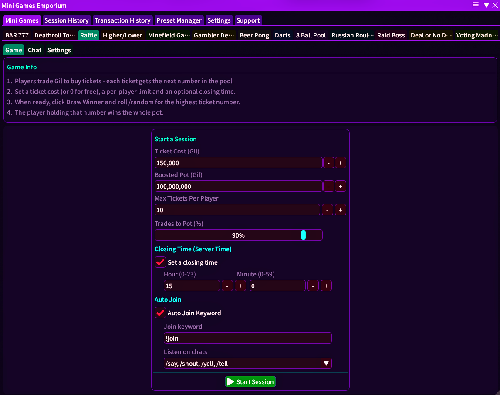

---

> **Game Tab: Lobby**
>
> 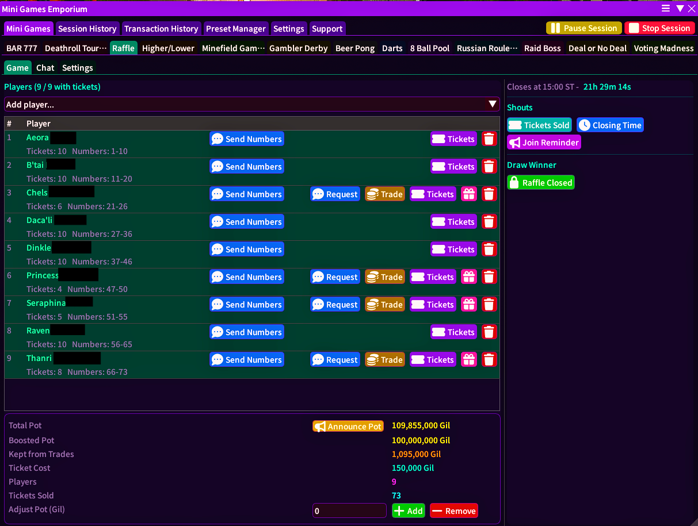

---

> **Game Tab: Draw**
>
> 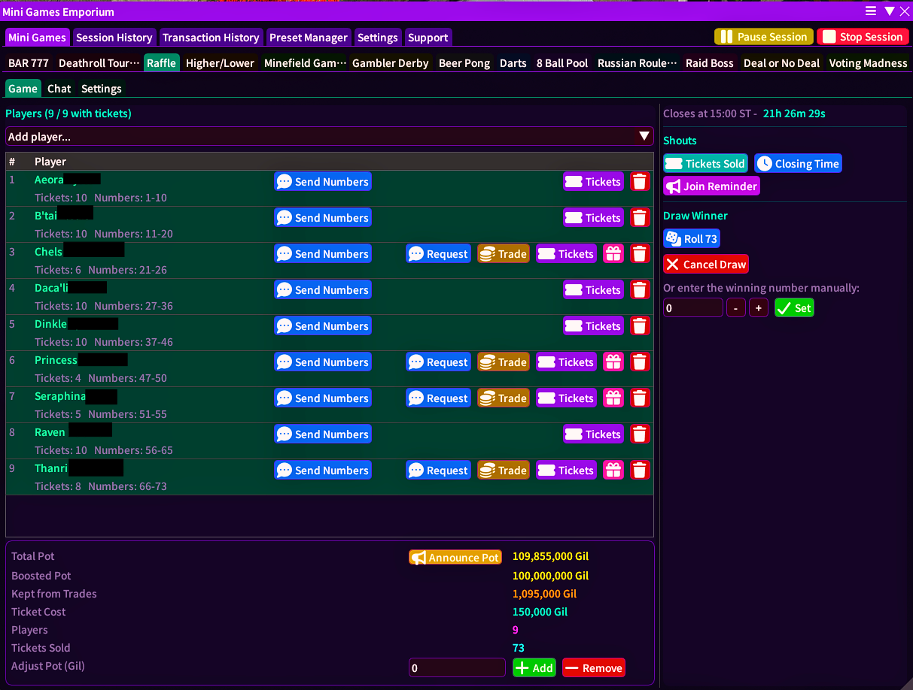

---

> **Session Complete: Winner**
>
> 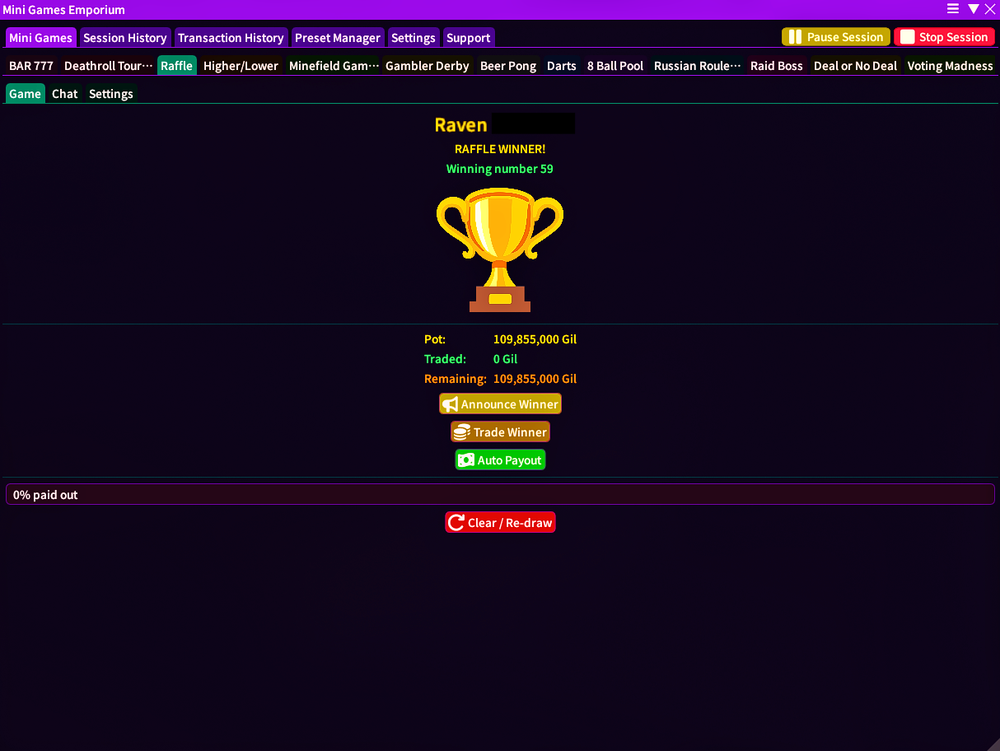

---

## Voting Madness

Voting Madness is a keyword poll. The host sets two or more voting options, players cast votes by saying an option keyword in chat, and the plugin tallies results on a live colour-coded bar chart. When the host stops the vote, the winning option (or a tie) can be announced with a custom shout.

### How It Works

1. The host opens the Voting Madness door, adds at least two voting options, chooses which chats to listen on, sets the vote rules and an optional closing time, then clicks **Start Session**.
2. Players cast a vote by saying an option keyword as a whole word in an enabled chat channel (Say, Shout, Yell, or Tell). The host's own messages are ignored.
3. The Game tab shows a live bar chart of the tallies and a voter table of every player who has voted.
4. When ready, the host clicks **Stop Vote**. Voting closes and the Vote Ended shout is sent automatically.
5. The host clicks **Announce Winning Vote** to shout the winner, or the tie message if two or more options share the lead.
6. **Stop Session** clears the session and writes the result to session history.

### Vote Options & Rules

Set on the door before the session starts (also editable on the Settings tab when no session is active). Options and rules are locked while a session is running.

| Option | Description |
|---|---|
| **Voting Options** | At least two unique keywords (defaults to Yes / No). Players vote by saying these words in chat |
| **Listen on chats** | Which channels accept votes: Say, Shout, Yell, and/or Tell. At least one must be enabled to start |
| **Multiple choice** | Players may vote for more than one option (one vote per option), across messages |
| **Allow multiple votes per person** | Players may vote for the same option more than once |
| **Closing Time (Server Time)** | Optional countdown target shown on the Game tab and used by the Closing Time shout |

With both multiple-choice and multiple-votes off, each player may cast only a single vote for the session.

### Closing Time

The host can optionally set a closing time in Server Time on the door. This drives the **Time Left** countdown on the Game tab and the Closing Time chat announcement - it does not lock voting or stop the poll automatically. Voting stays open until the host clicks **Stop Vote**.

### Statistics Panel

The Statistics panel at the bottom of the Game tab shows the live tallies:

| Row | Description |
|---|---|
| **Total Votes** | Number of votes cast this session |
| **Unique Voters** | Number of distinct players who have voted |
| **Leading Option** | The option currently ahead, or a tie list when more than one shares the top count |
| **Time Left** | Countdown to the configured closing time (shown only when a closing time is set); displays "Closed" once that time has passed |

### Automated Chat

Voting Madness includes a full set of customisable message templates, each editable in the Chat tab. All are manual triggers from the Game tab (Vote Ended also fires automatically when **Stop Vote** is pressed):

| Template | Trigger |
|---|---|
| Rules | Manually via **Send Rules** on the session control bar (each line is sent as its own message) |
| Advertise | Manually via **Advertise** on the session control bar |
| Announce Options | Manually via **Announce Options** on the Game tab |
| Vote Started | Manually via **Vote Started** on the Game tab |
| Closing Time | Manually via **Closing Time** when a close time is set |
| Standings | Manually via **Standings** on the Game tab |
| Vote Ended | When **Stop Vote** is pressed, and available as a button afterwards |
| Announce Winning Vote | Manually via **Announce Winning Vote** after the vote is stopped |
| Announce Tie | Used instead of Announce Winning Vote when options are tied |

Placeholders available in the templates include `{options}`, `{standings}`, `{winner}`, `{votes}`, `{percent}`, `{totalvotes}`, `{voters}`, `{closetime}`, and `{timeleft}`.

All outbound messages are queued with a one-second gap between each to stay within FFXIV's chat rate limits.

### Screenshots

> **Session Tab (Pre-Session)**
>
> 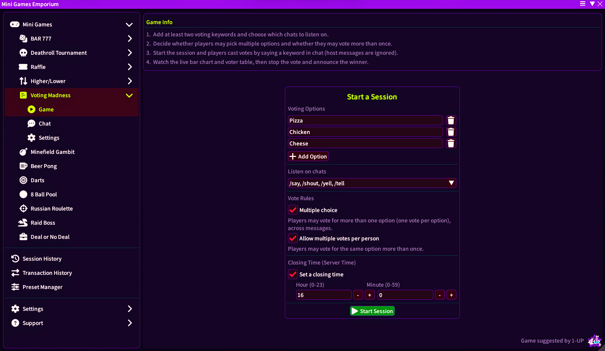

---

> **Game Tab: Voting Open**
>
> 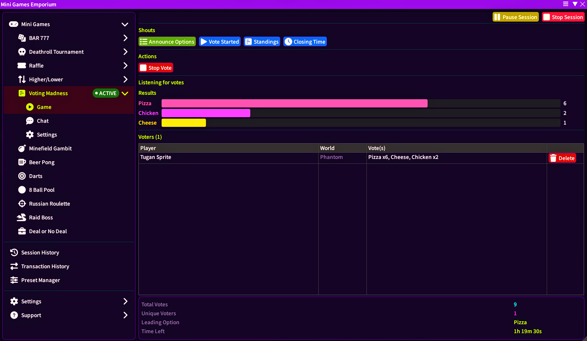

---

> **Game Tab: Vote Closed**
>
> 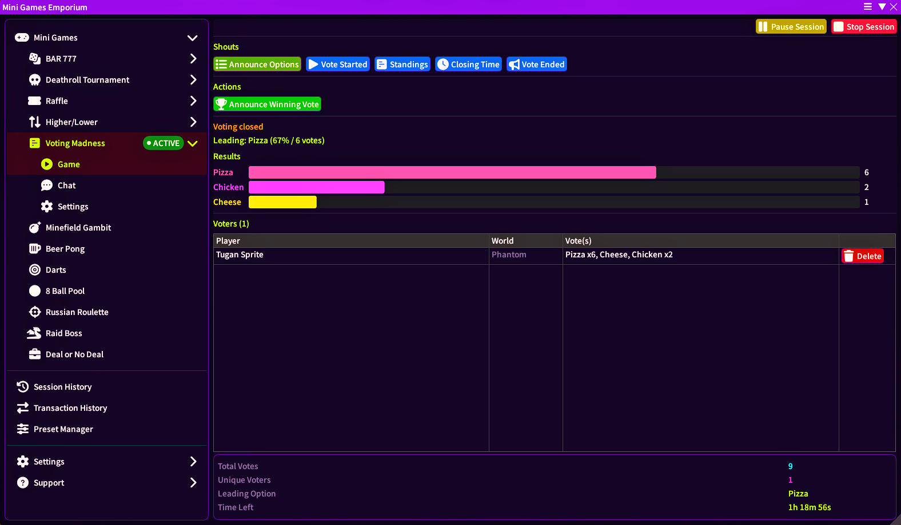

---

> **Chat Settings Tab**
>
> 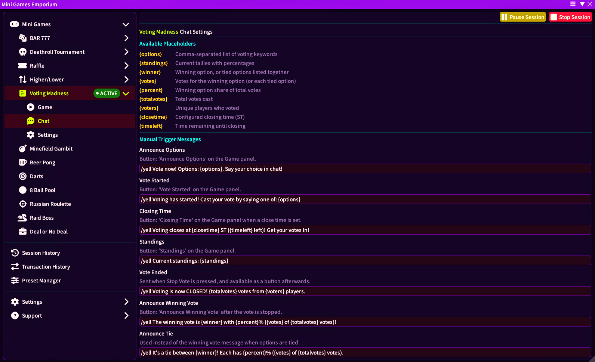

---

> **Settings Tab**
>
> 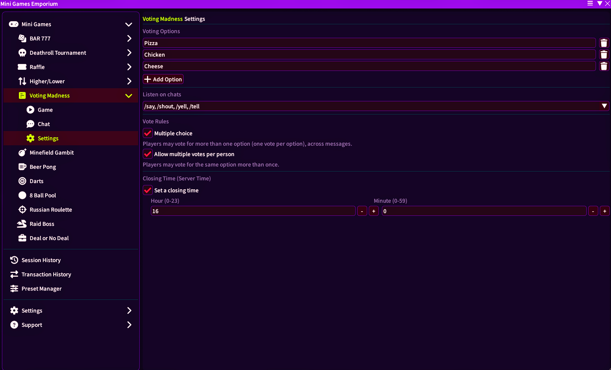

---

## Commands

| Command | Description |
|---|---|
| `/mge` | Open the main plugin window |
| `/minigamesemporium` | Alias for `/mge` |
| `/mgeconfig` | Open directly to the Settings tab |

---

## How to Install Mini Games Emporium

1. Type `/xlsettings` in the in-game chat to open the Dalamud settings window.
2. Go to the **Experimental** tab.
3. Paste this link into the **Custom Plugin Repositories** field at the bottom:

   `https://puni.sh/api/repository/oof-games`

4. Click the `+` button, ensure the repository is set to **Enabled**, and click **Save and Close**.
5. Type `/xlplugins`, search for **Mini Games Emporium**, and click **Install**.
