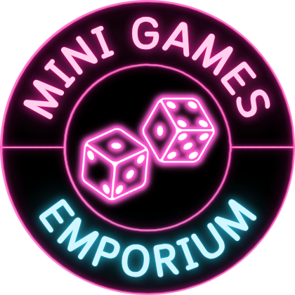

  

<h1 align="center">Mini Games Emporium</h1>

  A Dalamud plugin for Final Fantasy XIV, the official mini game hub for OOF Games venues.

---

## Overview

**Mini Games Emporium** is the all-in-one hosting tool powering every mini game run at OOF Games. It handles everything a host needs: player queues, session tracking, trade verification, automated chat announcements, and a full transaction ledger, so the host can stay focused on the crowd, not the spreadsheet.

The plugin lives inside FFXIV via the [Dalamud](https://github.com/goatcorp/Dalamud) framework and is accessed with `/mge` or `/minigamesemporium`.

### What's Inside

| Game | Status |
|---|---|
| **BAR 777** | ✅ Live |
| Minefield Gambit | 🔜 Coming Soon |
| Gambler Derby | 🔜 Coming Soon |
| Hot Shots | 🔜 Coming Soon |
| Beer Pong | 🔜 Coming Soon |
| Darts | 🔜 Coming Soon |
| 8 Ball Pool | 🔜 Coming Soon |

Each game gets its own tab inside the plugin's **Mini Games** section, styled in its own neon accent colour. The main window also holds a **Transaction History** ledger and a top-level **Settings** tab.

---

## BAR 777

BAR 777 is OOF Games' flagship game. Players pay an entry fee, then use FFXIV's built-in `/random` command to roll for the winning number. Hit it within the allotted rolls and you take home the pot.

### How It Works

1. The host opens the BAR 777 door, sets the entry cost, roll count, and winning number, then clicks **Start Session** (green button).
2. A player is pulled from the queue (or walks in) and the host targets them to lock them in.
3. The host clicks **Trade** to open a trade, and the plugin waits for the player's Gil to come through.
4. Once payment is verified, the host sends the start message and the player begins rolling `/random`.
5. The plugin watches chat in real time. Every roll is logged and compared against the winning number.
6. If the player hits the number, a win is detected automatically and a shout goes out. If they exhaust their rolls, an unlucky message fires and the session closes.
7. **End Session & Process Next** advances the queue and the next player is pulled in automatically.

### Entry Modes

#### Walk-in Mode

Walk-in is the default. There is no queue; players approach the host directly and are added to the session on the spot. The game tab goes full-width and shows a permanent **End Session** button. Ideal for low-traffic events or drop-in style nights.

#### Queue Mode

Queue mode activates an automatic waitlist. Players type a configured keyword (e.g. `!join`) in say, shout, yell, or tell and are added to the queue instantly. The plugin sends them a tell confirming their position.

The right-hand column of the Game tab shows the live queue at all times:

- **Current** - the active player with controls (To Back Q / Remove / End Session & Process Next)
- **Waiting list** - everyone else in order, with a manual add field at the bottom
- The queue persists across plugin restarts, so a crash mid-event doesn't wipe the list

When the active session ends normally, **End Session & Process Next** removes that player from the queue head and starts the next one automatically. **Stop Session** clears only the active session and leaves the waitlist untouched.

### The Pot

| Component | Description |
|---|---|
| **Entry Cost** | Gil paid by the player to play |
| **Boosted Pot** | Extra Gil added by the venue on top of trade revenue |
| **Total Pot** | Entry fees collected + Boosted Pot, shown on win shout |

The **Statistics** panel at the bottom of the Game tab shows live figures: Boosted Pot (gold), Taken in Trades (cyan), Players Played (magenta), and In Queue (white, queue mode only).

### Automated Chat

BAR 777 includes six fully customisable message templates with toggleable auto-send:

| Template | Trigger |
|---|---|
| Payment Request | Manually from Game tab |
| Tell Amount Request | Manually from Game tab |
| Start Rolls | When payment is verified |
| Halfway | At 50% of rolls used (auto-send toggle) |
| Unlucky | When all rolls are exhausted with no win (auto-send toggle) |
| Win Shout | On win detection, includes total pot (auto-send toggle) |

All outbound messages are queued with a one-second gap between each to stay within FFXIV's chat rate limits.

### Screenshots

> **Game Tab: Queue Mode**
>
> `[ screenshot placeholder ]`

---

> **Game Tab: Walk-in Mode**
>
> `[ screenshot placeholder ]`

---

> **BAR 777 Door (Pre-Session)**
>
> `[ screenshot placeholder ]`

---

> **Queue Panel**
>
> `[ screenshot placeholder ]`

---

> **Chat Settings Tab**
>
> `[ screenshot placeholder ]`

---

> **Transaction History**
>
> `[ screenshot placeholder ]`

---

## Commands

| Command | Description |
|---|---|
| `/mge` | Open the main plugin window |
| `/minigamesemporium` | Alias for `/mge` |
| `/mgeconfig` | Open directly to the Settings tab |

---

## Requirements

- **Final Fantasy XIV** with a valid subscription
- **Dalamud** plugin framework (via [XIVLauncher](https://goatcorp.github.io/))
- **ECommons** `≥ 3.2.0.18` (installed automatically as a dependency)

---

## License

[AGPL-3.0-or-later](LICENSE)
