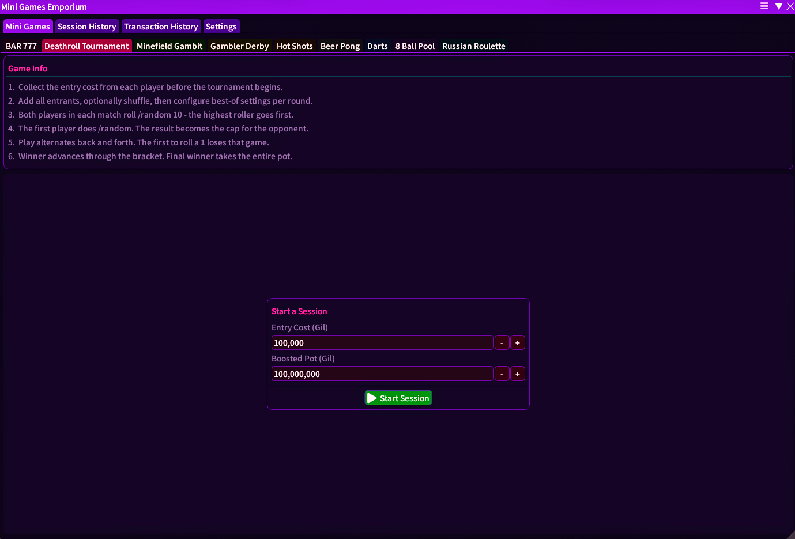

  

<h1 align="center">Mini Games Emporium</h1>

  A Dalamud plugin for Final Fantasy XIV, the official mini game hub for OOF Games venues.

---

## Overview

**Mini Games Emporium** is the all-in-one hosting tool powering every mini game run at OOF Games. It handles everything a host needs: player queues, session tracking, trade verification, automated chat announcements, and a full transaction ledger, so the host can stay focused on the crowd, not the spreadsheet.

The plugin lives inside FFXIV via the [Dalamud](https://github.com/goatcorp/Dalamud) framework and is accessed with `/mge` or `/minigamesemporium`.

### What's Inside

| Game | Status |
|---|---|
| **BAR 777** | ✅ Live |
| **Deathroll Tournament** | ✅ Live |
| Minefield Gambit | 🔜 Coming Soon |
| Gambler Derby | 🔜 Coming Soon |
| Hot Shots | 🔜 Coming Soon |
| Beer Pong | 🔜 Coming Soon |
| Darts | 🔜 Coming Soon |
| 8 Ball Pool | 🔜 Coming Soon |
| Russian Roulette | 🔜 Coming Soon |
| Raid Boss | 🔜 Coming Soon |
| Deal or No Deal | 🔜 Coming Soon |
| Voting Madness | 🔜 Coming Soon |

Each game gets its own tab inside the plugin's **Mini Games** section, styled in its own neon accent colour. The main window also holds a **Transaction History** ledger and a top-level **Settings** tab.

---

## BAR 777

BAR 777 is OOF Games' flagship game. Players pay an entry fee, then use FFXIV's built-in `/random` command to roll for the winning number. Hit it within the allotted rolls and you take home the pot.

### How It Works

1. The host opens the BAR 777 door, sets the entry cost, roll count, and winning number, then clicks **Start Session** (green button).
2. A player is pulled from the queue (or walks in) and the host targets them to lock them in.
3. The host clicks **Trade** to open a trade, and the plugin waits for the player's Gil to come through.
4. Once payment is verified, the host sends the start message and the player begins rolling `/random`.
5. The plugin watches chat in real time. Every roll is logged and compared against the winning number.
6. If the player hits the number, a win is detected automatically and a shout goes out. If they exhaust their rolls, an unlucky message fires and the session closes.
7. **End Session & Process Next** advances the queue and the next player is pulled in automatically.

### Entry Modes

#### Walk-in Mode

Walk-in is the default. There is no queue; players approach the host directly and are added to the session on the spot. The game tab goes full-width and shows a permanent **End Session** button. Ideal for low-traffic events or drop-in style nights.

#### Queue Mode

Queue mode activates an automatic waitlist. Players type a configured keyword (e.g. `!join`) in say, shout, yell, or tell and are added to the queue instantly. The plugin sends them a tell confirming their position.

The right-hand column of the Game tab shows the live queue at all times:

- **Current** - the active player with controls (To Back Q / Remove / End Session & Process Next)
- **Waiting list** - everyone else in order, with a manual add field at the bottom
- The queue persists across plugin restarts, so a crash mid-event doesn't wipe the list

When the active session ends normally, **End Session & Process Next** removes that player from the queue head and starts the next one automatically. **Stop Session** clears only the active session and leaves the waitlist untouched.

### The Pot

| Component | Description |
|---|---|
| **Entry Cost** | Gil paid by the player to play |
| **Boosted Pot** | Extra Gil added by the venue on top of trade revenue |
| **Total Pot** | Entry fees collected + Boosted Pot, shown on win shout |

The **Statistics** panel at the bottom of the Game tab shows live figures: Boosted Pot (gold), Taken in Trades (cyan), Players Played (magenta), and In Queue (white, queue mode only).

### Automated Chat

BAR 777 includes six fully customisable message templates with toggleable auto-send:

| Template | Trigger |
|---|---|
| Payment Request | Manually from Game tab |
| Tell Amount Request | Manually from Game tab |
| Start Rolls | When payment is verified |
| Halfway | At 50% of rolls used (auto-send toggle) |
| Unlucky | When all rolls are exhausted with no win (auto-send toggle) |
| Win Shout | On win detection, includes total pot (auto-send toggle) |

All outbound messages are queued with a one-second gap between each to stay within FFXIV's chat rate limits.

### Screenshots

> **BAR 777 Door (Pre-Session)**
>
> 

---
> **Game Tab: Queue Mode**
>
> 

---

> **Game Tab: Walk-in Mode**
>
> 

---

> **Chat Settings Tab**
>
> 

---

## Deathroll Tournament

Deathroll Tournament is a bracket-based elimination game. Each registered player pays an entry fee and competes in head-to-head deathroll matches. In deathroll, each player rolls within the range of the previous roll, starting from an agreed ceiling. The first player to roll a 1 loses the match. The plugin manages registration, seeding, the bracket, and all automated chat, so the host only needs to click to advance.

### How It Works

1. The host opens the Deathroll Tournament door, sets the entry cost, boosted pot, and best-of series lengths for each round, then clicks **Start Session**.
2. Players register by typing the join keyword in chat; the host marks each as **Paid** in the Registration tab once their Gil comes through.
3. When all paid players are confirmed, the host clicks **Start Tournament** to seed the bracket automatically (power-of-two seeding; bye slots are auto-resolved).
4. The plugin announces the first matchup and uses `/random 10` to determine which player rolls first.
5. Players deathroll in order. The plugin watches for the losing roll (a result of 1) and auto-advances the match.
6. The winner advances in the bracket; the next match is announced automatically.
7. The tournament ends when one player remains. A winner announcement fires and the Discord embed updates to show the champion.

### Registration

The Registration tab shows every player who has typed the join keyword. The host ticks each player as **Paid** once their trade clears. Only paid players are seeded into the bracket.

- **Entry Cost** - Gil each paid player owes the host.
- **Boosted Pot** - Extra Gil added by the venue on top of entry fees.
- **Registered** - All players who joined, including those not yet marked as paid.
- **Paid** - Players confirmed for the bracket.

### The Bracket

Once started, the Bracket tab shows the full single-elimination bracket in real time. Matches highlight the current pairing; completed matches show the winner in green. Bye slots are resolved instantly with no announcement.

The bracket is seeded in a standard power-of-two layout. If the paid player count is not a power of two, the plugin fills the smallest number of first-round byes required to reach the next power of two.

### Best-of Series

Each round can be configured with its own best-of count before the tournament starts (for example, Best of 1 in early rounds, Best of 3 in the semi-finals, Best of 5 in the final). The plugin tracks wins per match and only advances a player when they reach the winning threshold.

### Automated Chat

Deathroll Tournament includes fully customisable message templates for every key moment:

| Template | Trigger |
|---|---|
| Announce Bracket | When the bracket is generated; posts seeding order |
| Announce Matchup | At the start of each match |
| Announce First Player | After `/random 10` determines who rolls first |
| Announce Reroll | When a `/random 10` result requires a reroll (tie) |
| Match Win | When a player wins a single deathroll game within a series |
| Round Win | When a player wins the series and advances |
| Tournament Winner | When the final match resolves |
| Announce Pot | Posts the current pot size on demand |

All outbound messages are queued with a one-second gap between each to stay within FFXIV's chat rate limits.

### Discord Webhook

Deathroll Tournament can post and live-update a single Discord embed via a channel webhook throughout the event.

To set it up, go to the **Discord** tab within the Deathroll Tournament panel:

1. In Discord, open channel settings for your tournament announcement channel, go to **Integrations > Webhooks**, and copy the webhook URL.
2. Paste the URL into the Webhook URL field and tick **Enable**.
3. The plugin will post the embed immediately and patch it automatically as the tournament progresses.

| Phase | Embed content |
|---|---|
| No session active | "No Tournament Active" banner with the Deathroll Tournament logo |
| Registration open | Player card showing all paid players, entry cost, and current pot |
| Tournament running | Live bracket image with current match and score highlighted |
| Tournament complete | Final bracket image with the winner and pot total |

If the Discord message is deleted, toggle **Enable** off then on to create a fresh embed. The same toggle retries a failed delivery.

### Screenshots

> **Session Tab (Pre-Session)**
>
> 

---

> **Lobby (Registration)**
>
> 

---

> **Bracket**
>
> 

---

> **Example: Live Bracket Embed (Discord)**
>
> 

---

## Commands

| Command | Description |
|---|---|
| `/mge` | Open the main plugin window |
| `/minigamesemporium` | Alias for `/mge` |
| `/mgeconfig` | Open directly to the Settings tab |

---

## Requirements

- **Final Fantasy XIV** with a valid subscription
- **Dalamud** plugin framework (via [XIVLauncher](https://goatcorp.github.io/))
- **ECommons** `≥ 3.2.0.18` (installed automatically as a dependency)

---

## License

[AGPL-3.0-or-later](LICENSE)
